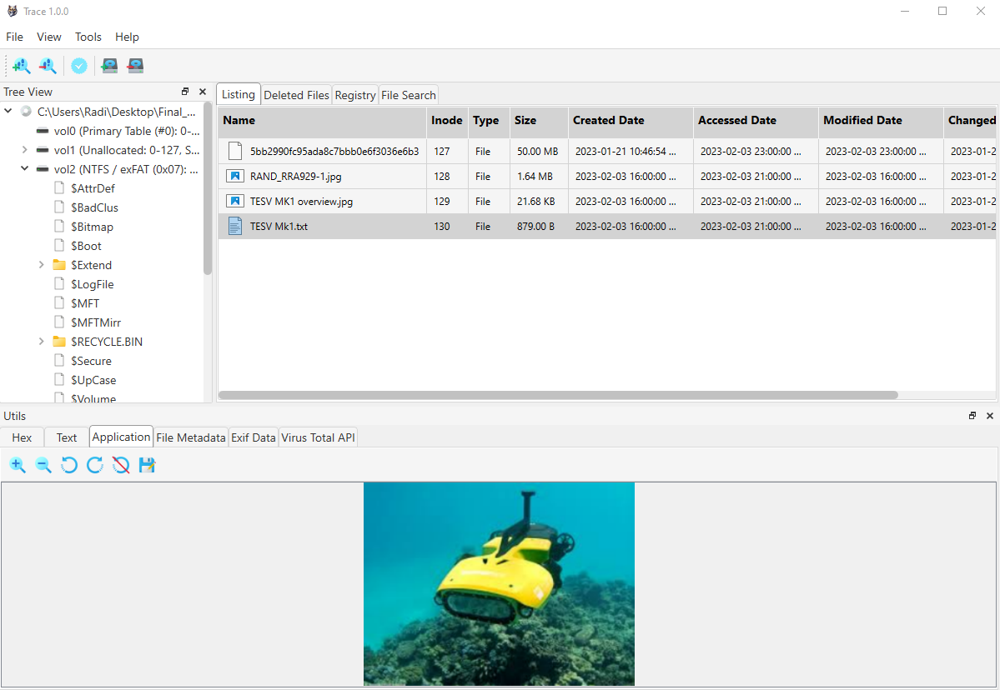
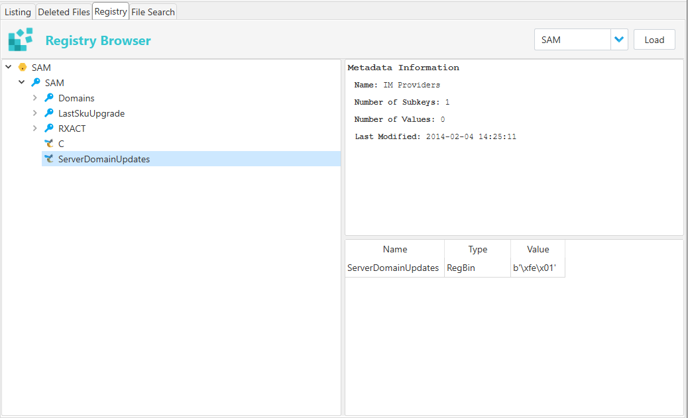
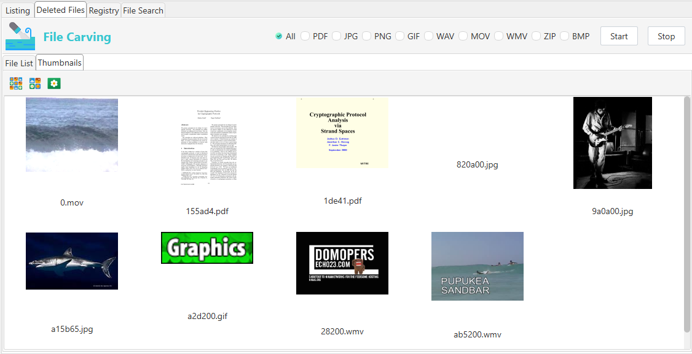
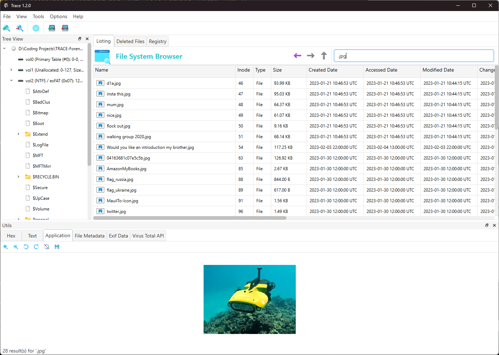
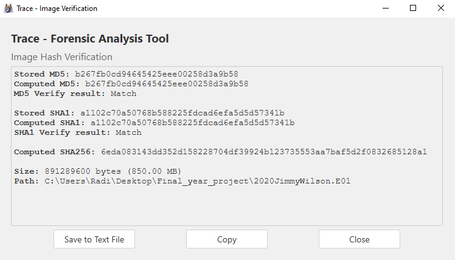
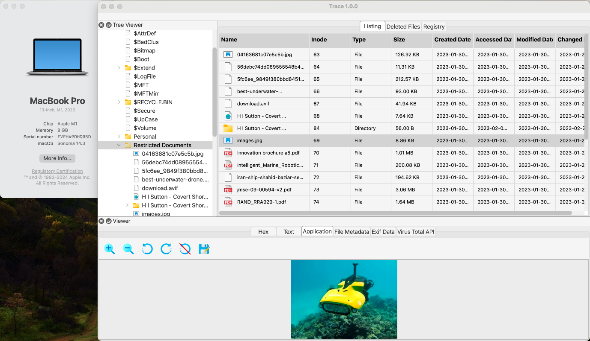
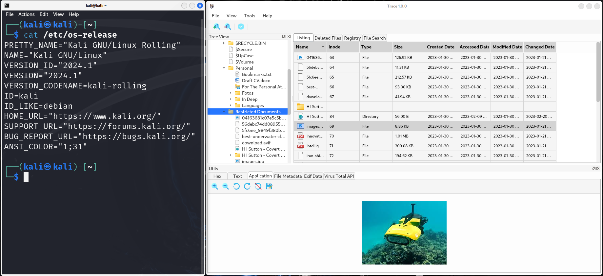
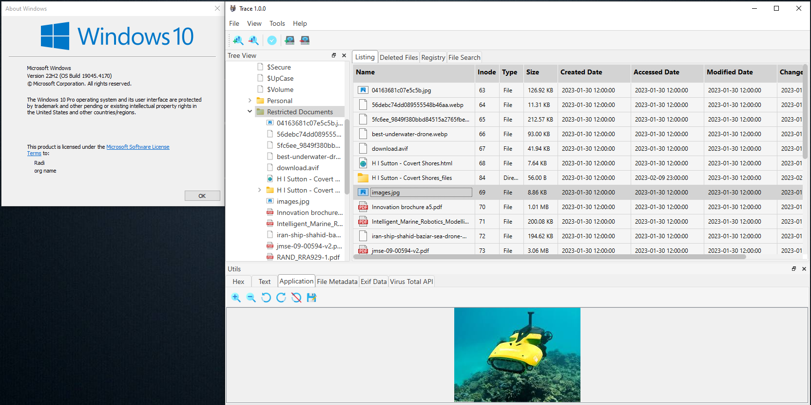

<h1 align="center">Toolkit for Retrieval and Analysis of Cyber Evidence (TRACE)</h1>

<p align="center">
  TRACE is a digital forensic tool I developed as my final year project. It provides an intuitive interface for analyzing disk images and includes a range of functionalities to assist forensic examiners in extracting and viewing the contents of various image file formats.
</p>

<p align="center">
  
</p>

## Navigation 🧭 

- [Preview 👀](#preview-)
- [Features 🌟](#features-)
- [Screenshots 📸](#screenshots-)
- [Supported Image Formats 💾](#supported-image-formats-)
- [Tested File Systems 🗂️](#tested-file-systems-%EF%B8%8F)
- [Cross-Platform Compatibility 🖥️💻](#cross-platform-compatibility-%EF%B8%8F)
- [Getting Started 🚀](#getting-started-)
  - [Prerequisites 🛠️](#prerequisites-)
  - [Configuration ⚙️](#configuration-%EF%B8%8F)
  - [Running the Tool ▶️](#running-the-tool-%EF%B8%8F)
- [Built With 🧱](#built-with-)
- [Work in Progress 🛠️](#work-in-progress-)
- [Testing & Feedback 🧪](#testing--feedback-)
- [Contributing 🤝](#contributing-)
- [Socials 👨‍💻](#socials-)


## Preview 👀 &nbsp;&nbsp;&nbsp;&nbsp; [⬆️](#toolkit-for-retrieval-and-analysis-of-cyber-evidence-trace)

<p>
  <br/>
  
  <br/>
</p>

<br>

## Features 🌟 &nbsp;&nbsp;&nbsp;&nbsp; [⬆️](#toolkit-for-retrieval-and-analysis-of-cyber-evidence-trace)

✅ ***Image Mounting**: Mount forensic disk images. (Windows only) \
✅ **Tree Viewer**: Navigate through the disk image structure, including partitions and files.\
✅ **Detailed File Analysis**: View file content in different formats, such as HEX, text, and application-specific views.\
✅ **EXIF Data Extraction**: Extract and display EXIF metadata from photos.\
✅ **Registry Viewer**: View and examine Windows registry files.\
✅ **Basic File Carving**: Recover deleted files from disk images.\
✅ **Virus Total API Integration**: Check files for malware using the Virus Total API.\
✅ **E01 Image Verification**: Verify the integrity of E01 disk images.\
✅ **Convert E01 to Raw**: Convert E01 disk images to raw format.\
✅ **Message Decoding**: Decode messages from base64, binary, and other encodings.

<br>

## Screenshots 📸 &nbsp;&nbsp;&nbsp;&nbsp; [⬆️](#toolkit-for-retrieval-and-analysis-of-cyber-evidence-trace)

### Registry Browser 🗂️

<p>
  <br/>
  
  <br/>
</p>


### File Carving 🔪

<p>
  <br/>
  
  <br/>
</p>

### File Search 🔍
<p>
  <br/>
  
  <br/>
</p>

### Image Verification ✅

<p>
  <br/>
  
  <br/>
</p>

<br>


## Supported Image Formats 💾 &nbsp;&nbsp;&nbsp;&nbsp; [⬆️](#toolkit-for-retrieval-and-analysis-of-cyber-evidence-trace)

| Image Format                                   | Extensions             | Split   |  Unsplit |
|------------------------------------------------|------------------------|---------|----------|
| EnCase® Image File (EVF / Expert Witness Format)| `*.E01` `*.Ex01`       | ✔️      | ✔️       |
| SMART/Expert Witness Image File                | `*.s01`                | ✔️      | ✔️       |
| Single Image Unix / Linux DD / Raw             | `*.dd`, `*.img`, `*.raw` | ✔️      | ✔️       |
| ISO Image File                                 | `*.iso`                |         | ✔️       |
| AccessData Image File                          | `*.ad1`                | ✔️       | ✔️        |

<br>

## Tested File Systems 🗂️ &nbsp;&nbsp;&nbsp;&nbsp; [⬆️](#toolkit-for-retrieval-and-analysis-of-cyber-evidence-trace)

| File System | Tested |
|-------------|--------|
| NTFS        | ✔️     |
| FAT32       |        |
| exFAT       |        |
| HFS+        |        |
| APFS        |        |
| EXT2,3,4    |        |

<br>


## Cross-Platform Compatibility 💻🖥️  &nbsp;&nbsp;&nbsp;&nbsp; [⬆️](#toolkit-for-retrieval-and-analysis-of-cyber-evidence-trace)

| Operating System       | Screenshot                                                                                                                     |
|------------------------|--------------------------------------------------------------------------------------------------------------------------------|
| **macOS Sonoma** 🍏    | <a href="Icons/readme/macos.png"></a>                    |
| **Kali Linux 2024** 🐧 | <a href="Icons/readme/kali.png"></a>      |
| **Windows 10** 🗔     | <a href="Icons/readme/windows10.png"></a> |


## Getting Started 🚀 &nbsp;&nbsp;&nbsp;&nbsp; [⬆️](#toolkit-for-retrieval-and-analysis-of-cyber-evidence-trace)

### Prerequisites 🔧
- Ensure you have all the necessary Python libraries installed.

```bash
pip install -r requirements.txt
  ```
### Configuration ⚙️

- **API Keys Configuration**: The tool integrates with VirusTotal and Veriphone APIs, and you will need to provide your own API keys to use these features. Update the API keys in the following files:

  - For VirusTotal: Update the API key in `modules/virus_total_tab.py`
  - For Veriphone: Update the API key in `modules/veriphone_api.py`


### Running the Tool ▶️


```bash
python main.py
```
<br>

## Built With 🧱  &nbsp;&nbsp;&nbsp;&nbsp; [⬆️](#toolkit-for-retrieval-and-analysis-of-cyber-evidence-trace)

- [pytsk3](https://pypi.org/project/pytsk3/) - Python bindings for the SleuthKit
- [libewf-python](https://github.com/libyal/libewf) - Library to access the Expert Witness Compression Format (EWF)
- [PySide6](https://pypi.org/project/PySide6/) - Used for the GUI components.
- [Arsenal Image Mounter](https://arsenalrecon.com/products/image-mounter/) - For mounting forensic disk images.


## Work in Progress 🧑‍🔧  &nbsp;&nbsp;&nbsp;&nbsp; [⬆️](#toolkit-for-retrieval-and-analysis-of-cyber-evidence-trace)

- **Direct Video/Audio Playback**: Currently, the video and audio player saves files temporarily before playing them, which can cause delays. The goal is to enable direct playback for faster performance.
- **Integrated File Search and Viewer**: The file search functionality is not yet connected to the "Viewer Tab," which displays HEX, text, application-specific views, metadata, and other details. This integration needs to be implemented.
- **Cross-Platform Image Mounting**: Image mounting currently works only on Windows using the Arsenal Image Mounter executable. The aim is to make this feature work across all platforms without relying on external executables.
- **File Carving and Viewer Integration**: The file carving functionality is not yet connected to the "Viewer Tab," where users can view HEX, text, application-specific views, and metadata. Additionally, the current file carving process does not distinguish between deleted and non-deleted files; it will "carve" all files of the selected type from the disk image.
- **Color Issues in Dark Mode**: The software currently has some colour display issues on Linux and macOS systems when using dark mode. Certain UI elements may not be clearly visible or may appear incorrectly.

## Testing & Feedback 🧪  &nbsp;&nbsp;&nbsp;&nbsp; [⬆️](#toolkit-for-retrieval-and-analysis-of-cyber-evidence-trace)

- **Tested Formats**: The tool has primarily been tested with `dd` and `E01` files. While these formats are well-supported, additional testing with other formats, such as `Ex01`, `Lx01`, `s01`, and others, is needed.
- **Tested File Systems**: Currently, the tool has only been tested on the NTFS file system. Testing on additional file systems like FAT32, exFAT, HFS+, APFS, EXT4, and others is needed to ensure broader compatibility.
- **Call for Samples**: If you have disk images in formats that are less tested (`Ex01`, `Lx01`, `s01`, etc.), your contributions would be greatly appreciated to help improve the tool's compatibility and robustness.
- **Feedback Welcome**: Please report any issues or unexpected behaviour to help improve the tool. Contributions and testing feedback are encouraged and welcomed.

## Contributing 🤝 &nbsp;&nbsp;&nbsp;&nbsp; [⬆️](#toolkit-for-retrieval-and-analysis-of-cyber-evidence-trace)

I welcome contributions from the community to help improve TRACE! If you're interested in contributing, here’s how you can get involved:

### How to Contribute

1. **Report Issues**: If you find any bugs or have suggestions for improvements, please [open an issue](https://github.com/Gadzhovski/TRACE-Forensic-Toolkit/issues) on GitHub. Provide as much detail as possible to help address the issue effectively.
2. **Submit a Pull Request**: If you have a fix or feature you’d like to contribute, please [fork the repository](https://github.com/Gadzhovski/TRACE-Forensic-Toolkit/fork), make your changes, and submit a pull request. Ensure your code adheres to the coding standards and includes tests where applicable.
3. **Provide Testing Samples**: If you have disk images in formats that are less tested (`Ex01`, `Lx01`, `s01`, etc.), your contributions would be greatly appreciated to help improve the tool’s compatibility and robustness. You can share these samples by [contacting me](https://gadzhovski.com/).
4. **Review and Feedback**: Review the changes submitted by others and provide feedback to help refine and enhance the tool.


## Socials 👨‍💻 &nbsp;&nbsp;&nbsp;&nbsp; [⬆️](#toolkit-for-retrieval-and-analysis-of-cyber-evidence-trace)


[](https://linkedin.com/in/radoslav-gadzhovski)

<br>


