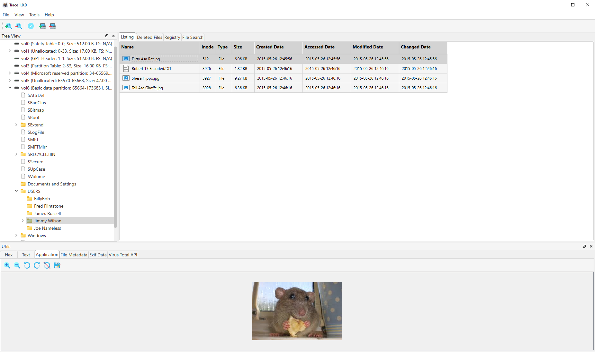

<h1 align="">Toolkit for Retrieval and Analysis of Cyber Evidence (TRACE)</h1>

Trace is a digital forensic tool designed to provide an intuitive interface for analyzing disk images. \
It offers a range of functionalities to assist forensic examiners in extracting and viewing the contents of various image file formats.

<p align="">
  
</p>

## Features

- [x] **Image Mounting & Dismounting**: Seamlessly mount and dismount forensic disk images for analysis.
- [x] **Tree Viewer**: Navigate through the disk image structure, including partitions and files.
- [x] **Detailed File Analysis**: View file content in different formats, such as HEX, text, and application-specific views.
- [x] **EXIF Data Extraction**: Extract and display EXIF metadata from image files.
- [x] **Registry Viewer**: View and analyze Windows registry files.
- [x] **Basic File Carving**: Recover deleted files from disk images.
- [x] **Virus Total Api Integration**: Check files for malware using the Virus Total API.
- [x] **E01 Image Verification**: Verify the integrity of E01 disk images.
- [x] **Convert E01 to Raw**: Convert E01 disk images to raw format.

## Supported Image Formats
- E01
- raw
- dd
- iso

## Preview



## Getting Started

### Prerequisites

- Ensure you have all the necessary Python libraries installed. Check `requirements.txt` for the list of libraries.

```bash
pip install -r requirements.txt
  ```
  


### Running the Tool

```bash
python main.py
```

## Built With

- [pytsk3](https://pypi.org/project/pytsk3/) - Python bindings for the SleuthKit
- [libewf-python](https://github.com/libyal/libewf) - Library to access the Expert Witness Compression Format (EWF)
- [PySide6](https://pypi.org/project/PySide6/) - Used for the GUI components.
- [Arsenal Image Mounter](https://arsenalrecon.com/products/image-mounter/) - For mounting forensic disk images.

## Author

**Radoslav Gadzhovski**  
- [GitHub Profile](https://github.com/Gadzhovski)
- [LinkedIn Profile](https://www.linkedin.com/in/radoslav-gadzhovski/)


## License

This project is licensed under the MIT License - see the `LICENSE` file for details.


