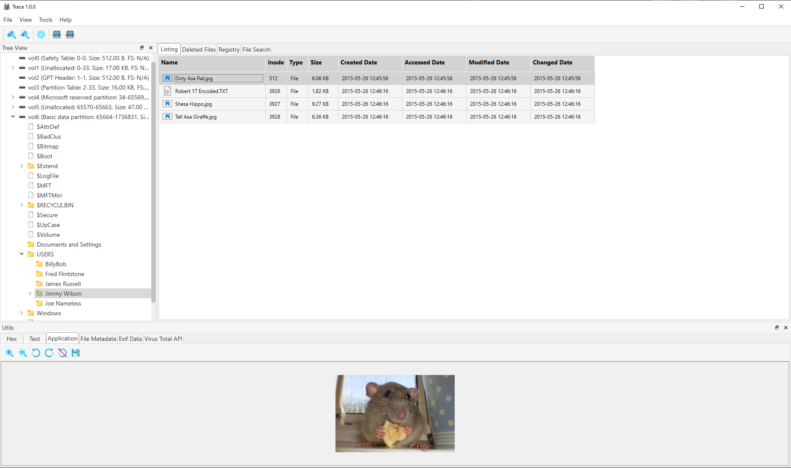

<h1 align="center">Toolkit for Retrieval and Analysis of Cyber Evidence (TRACE)</h1>

<p align="center">
  Trace is a digital forensic tool designed to provide an intuitive interface for analyzing disk images. 
  It offers a range of functionalities to assist forensic examiners in extracting and viewing the contents of various image file formats.
</p>

<p align="center">
  
</p>

[//]: # (## Preview 👀)

[//]: # (<p align="center">)

[//]: # (  <br/>)

[//]: # (  )

[//]: # (  <br/>)

[//]: # (</p>)

## Features 🌟

✅ **Image Mounting & Dismounting**: Seamlessly mount and dismount forensic disk images for analysis.\
✅ **Tree Viewer**: Navigate through the disk image structure, including partitions and files.\
✅ **Detailed File Analysis**: View file content in different formats, such as HEX, text, and application-specific views.\
✅ **EXIF Data Extraction**: Extract and display EXIF metadata from image files.\
✅ **Registry Viewer**: View and analyze Windows registry files.\
✅ **Basic File Carving**: Recover deleted files from disk images.\
✅ **Virus Total API Integration**: Check files for malware using the Virus Total API.\
✅ **E01 Image Verification**: Verify the integrity of E01 disk images.\
✅ **Convert E01 to Raw**: Convert E01 disk images to raw format.\
✅ **Message Decoding**: Decode messages from base64, binary, and other encodings.


## Supported Image Formats 💾

| Image Format                                   | Extensions                     | Split   |  Unsplit |
|------------------------------------------------|--------------------------------|---------|----------|
| EnCase® Image File (EVF / Expert Witness Format)| `*.e01`                       | ✔️      | ✔️       |
| SMART/Expert Witness Image File                | `*.s01`                        | ✔️      | ✔️       |
| Single Image Unix / Linux DD / Raw             | `*.dd`, `*.img`, `*.raw`       | ✔️      | ✔️       |
| ISO Image File                                 | `*.iso`                        |         | ✔️       |
| AccessData Image File                          | `*.ad1`                        | ✔️       | ✔️        |


## Getting Started 🚀


### Prerequisites

- Ensure you have all the necessary Python libraries installed.

```bash
pip install -r requirements.txt
  ```

### Running the Tool

```bash
python main.py
```

## Built With 🧱

- [pytsk3](https://pypi.org/project/pytsk3/) - Python bindings for the SleuthKit
- [libewf-python](https://github.com/libyal/libewf) - Library to access the Expert Witness Compression Format (EWF)
- [PySide6](https://pypi.org/project/PySide6/) - Used for the GUI components.
- [Arsenal Image Mounter](https://arsenalrecon.com/products/image-mounter/) - For mounting forensic disk images.

[//]: # (## Socials 👨‍💻)

[//]: # ()
[//]: # ()
[//]: # ([![LinkedIn]&#40;https://img.shields.io/badge/LinkedIn-%230077B5.svg?logo=linkedin&logoColor=white&#41;]&#40;https://linkedin.com/in/radoslav-gadzhovski&#41;)

[//]: # ()
[//]: # (<br>)


