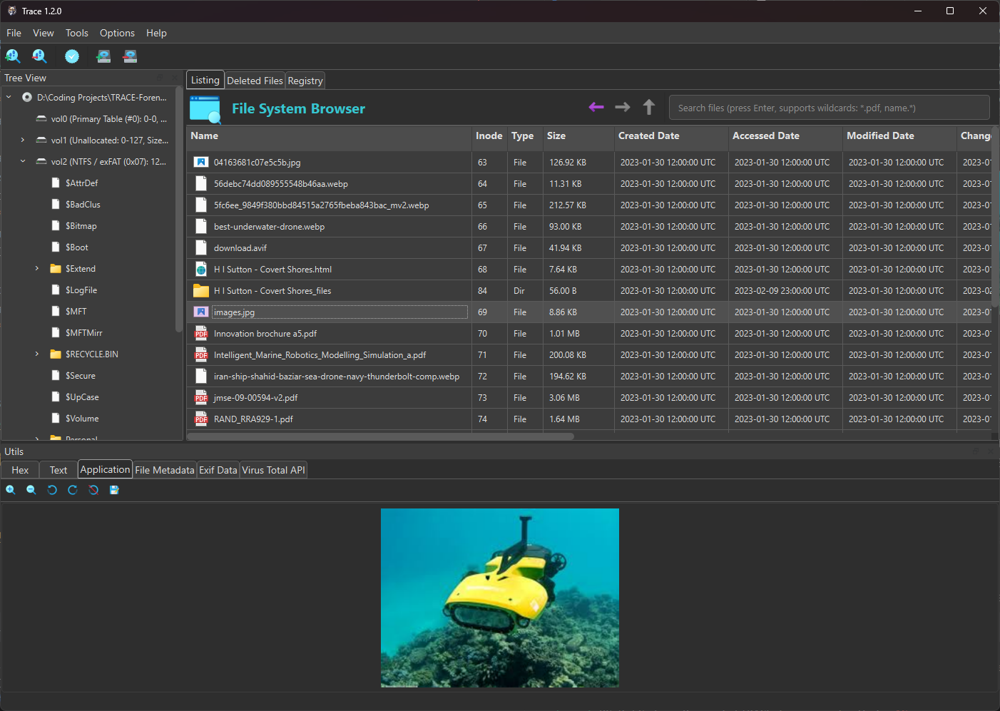
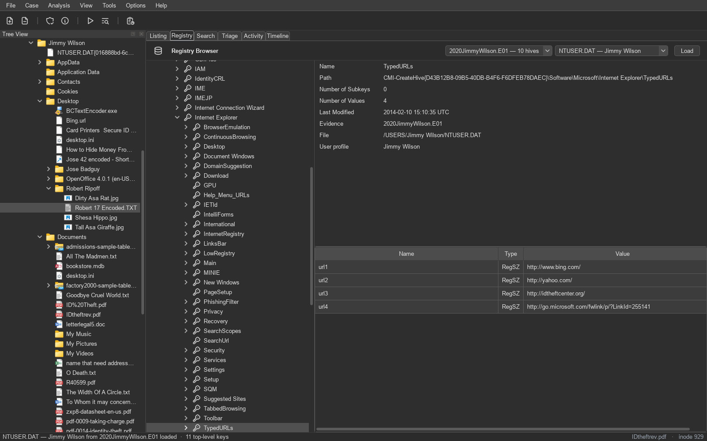
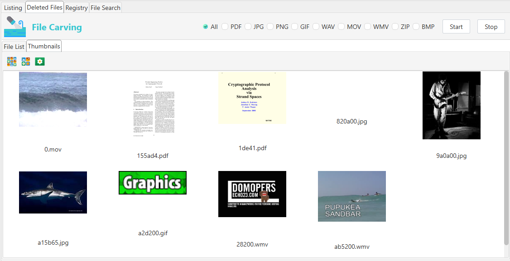
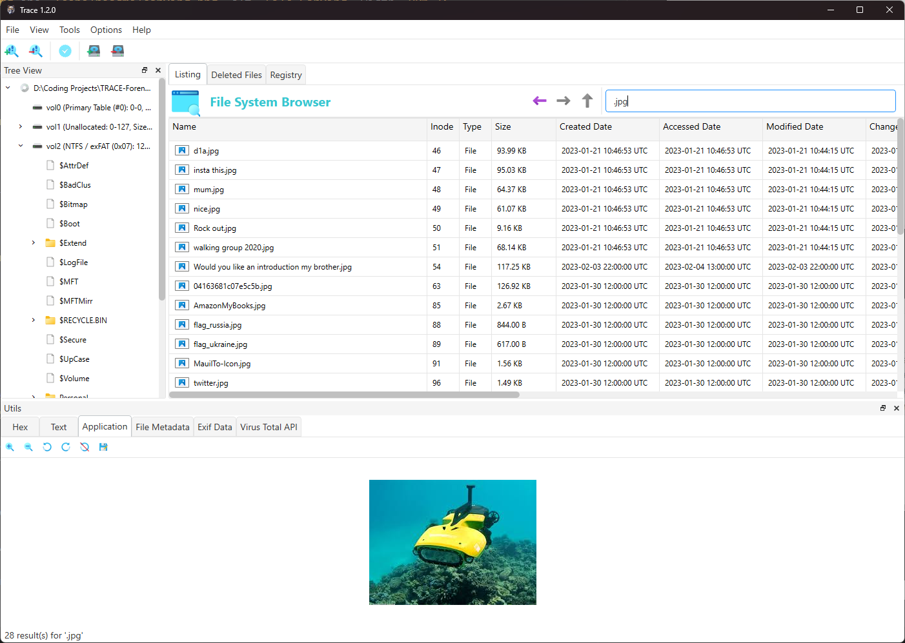
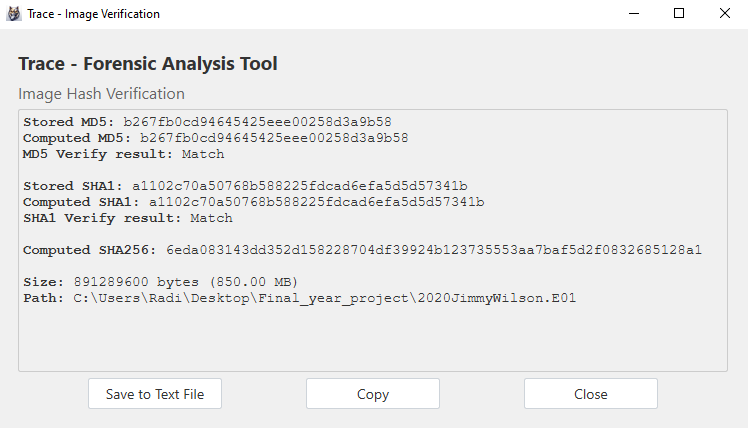
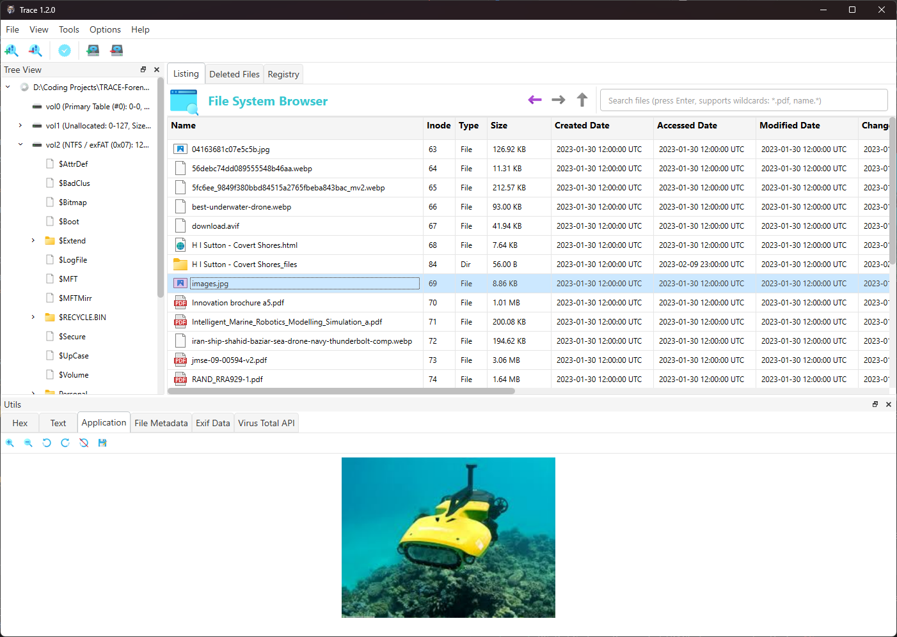
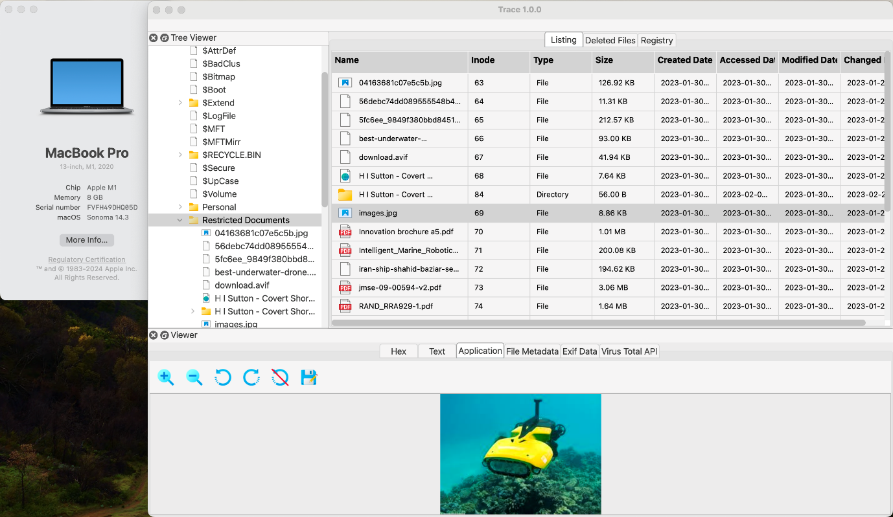
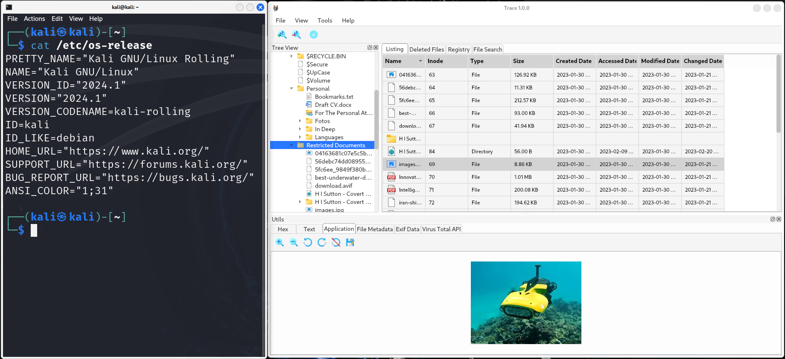
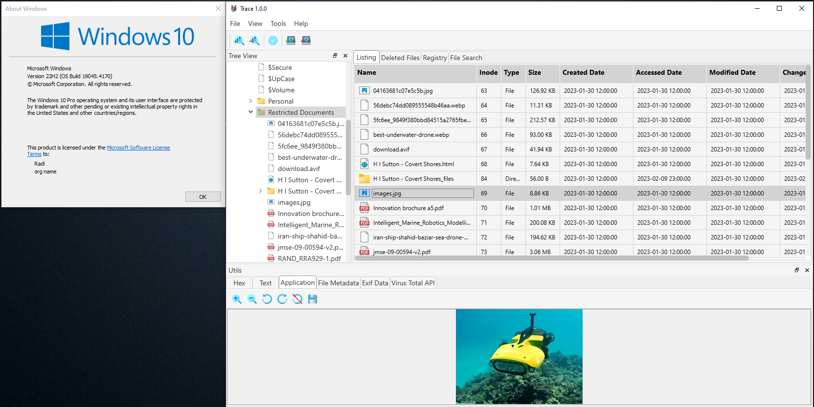
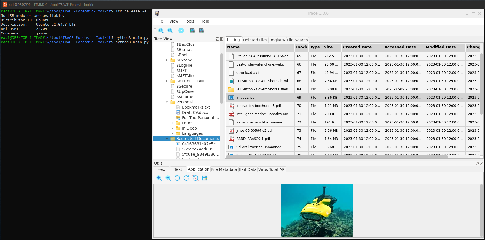

<div align="center">


# TRACE

**Toolkit for Retrieval and Analysis of Cyber Evidence**

Open forensic disk images read-only, organise an investigation into a case,<br/>
triage what stands out, search inside the evidence, and recover deleted files — without mounting anything.

<p>
  
  
  
  
  
  <a href="https://github.com/Gadzhovski/TRACE-Forensic-Toolkit/actions/workflows/tests.yml"></a>
</p>

<a href="#installation"><b>Install</b></a> ·
<a href="#features"><b>Features</b></a> ·
<a href="#screenshots"><b>Screenshots</b></a> ·
<a href="#supported-formats"><b>Formats</b></a> ·
<a href="#configuration"><b>Configuration</b></a>

<br/>



</div>

<br/>

## Overview

TRACE reads disk images directly through [The Sleuth Kit](https://www.sleuthkit.org/)
(via `pytsk3`) and [libewf](https://github.com/libyal/libewf). Evidence is opened
read-only and is never mounted, so the image is not modified and no write-blocker
configuration is required.

Work is organised into **cases**. A case is one investigation and can hold disk
images from several devices; every file, finding and bookmark is always shown
with the image it came from. A case is a folder holding a SQLite database plus
its carved files, exports and search index; the evidence itself is referenced by
path and hash, never copied.

It began as a final-year project and is intended for learning, lab work, and
triage rather than as a replacement for a commercial forensic suite.

> [!NOTE]
> Tested on **E01** and **raw** images with **NTFS** (including compressed and
> EFS-encrypted files), **FAT12/16/32**, **exFAT**, **Ext2/3/4**, **HFS+** and
> **ISO 9660**, against the DFTT, DFRWS, NPS and NIST test corpora. Carving is
> signature-based and scored against published answer keys (see
> [Testing](#testing)); verify anything it recovers.

<br/>

## Features

<table>
<tr>
<td width="50%" valign="top">

### 📁 Cases across devices

Start with **New Case**, **Open Case** or **Quick Triage** (no case). New Case
is a guided setup — case details, the evidence (each image opened and checked
as it is added, its exhibit number and acquisition details filled from the
E01 header), the analysis modules as a Quick / Standard / Full profile, and a
review before anything is written. A case remembers its evidence and reopens
it; several images — a laptop, a phone, a USB stick — live in one case, each
kept open and clearly named. Every view says which image a file belongs to,
and opening anything reads its own image.

</td>
<td width="50%" valign="top">

### ✅ Evidence integrity

Hashes every image when it joins a case — in the background — and compares
E01 and AD1 images with their acquisition hashes. Verification is kept as a
**history**, not a current value, and every check, hash sent out and
evidence change is written to the case's audit log.

</td>
</tr>
<tr>
<td width="50%" valign="top">

### 🩺 Triage analysis

One pass over every file, whichever modules are chosen:

- **File type** from content — flags an executable named `.jpg`
- **Entropy** (mean and peak) — packed or encrypted data
- **Hashes and duplicates** — MD5 / SHA-1 / SHA-256, copies across devices
- **Hash sets** — known good (NSRL) hidden, known bad and notable flagged
  (below)
- **NTFS internals** — both sets of $MFT times, the change journal, streams
  and downloads (below)
- **Hidden data** — `invoice.pdf.exe`, reversed-text names, data appended after
  the end of a JPEG / PNG / PDF, password-protected archives / Office / PDFs,
  and files that look like encrypted (VeraCrypt-style) volumes
- **Photo metadata** — camera, capture time, software, GPS position
- **Document authors** — author, last saved by, company, application, dates
- **Executables** — Windows PE, Linux ELF and macOS Mach-O (universal too)
  read from their own headers: architecture, link time (or that a
  reproducible build put a hash there), signer and certificate dates
  (present, not verified), imports and exports, sections with their
  entropy, version strings, PDB / build id, appended data. Flags packers,
  writable code, near-random code, imports used together for process
  injection or hollowing, a file that calls itself something else
  (`svchost.exe` whose version says `mimikatz.exe`) and a driver altered
  after linking. Checked against pefile and pyelftools on real releases
- **Search index and indicators** — every file's text indexed for search,
  and the indicators in it listed (right)
- **Windows activity and browser history** — what the users did (below)
- **File carving** — deleted files recovered from the raw image (below)

Run against every image in the case or one. Findings are graded (suspicious /
notable) and appear in the listing, a Triage tab with a sub-tab each, and a
Findings node in the tree grouped by device — photos, authors, carved files
and indicators included.

</td>
<td width="50%" valign="top">

### 🔎 Universal search

A per-case full-text index over file contents — PDFs, Office documents, registry
hives, plain text in ASCII and UTF-16 — built as an analysis module on the
background queue, for every image or one. Supports `"phrases"`, `prefix*`,
`AND` / `OR` / `NOT`, `/regex/` and field prefixes such as `email:` and `name:`.
**Carved files are searched too**, and the files inside them — a carved
`.docx` by its text, a carved ZIP's members, a carved mailbox's messages —
read back from the image (each fragment, for a rebuilt file); a new carve
replaces the last one's entries. So is the text in files' slack.

**Indicators** are pulled out as it indexes: **emails, URLs, domains,
IPv4/IPv6 addresses, phone numbers, card numbers, IBANs, Bitcoin addresses and
hashes**. Card numbers must pass the Luhn check under a real scheme's prefix,
and IBANs their country's length and mod-97 check digits, so a run of digits
is not reported as one. Triage ▸ Indicators lists every distinct value — by
kind, per image — and the files holding each, with the text around it;
Findings ▸ Indicators in the tree counts them by kind.

</td>
</tr>
<tr>
<td width="50%" valign="top">

### 🕵 What the users did

The **Activity** tab, read from where Windows keeps it — not by walking every
file, so it takes seconds:

- **Programs run** — Prefetch (XP to Windows 11, including Windows 10's
  compressed files), Amcache with SHA-1, Shimcache, UserAssist
- **PowerShell** — every command typed (PSReadLine history, per user and
  host, multi-line commands joined) and every script block run (event
  4104, its parts joined; the ones PowerShell itself flagged as suspicious
  marked) — decoded as PowerShell ran it, so obfuscation is undone
- **Files and folders opened** — Recent shortcuts (target times, volume,
  machine and MAC), Jump Lists, RecentDocs, ShellBags (folders on drives and
  shares that are gone)
- **USB devices** — first and last connected and removed, drive letter, from
  the registry and setupapi; the volumes and shares each user mounted
  (MountPoints2)
- **Networks** — every network joined, first and last connected, gateway
  MAC and DNS suffix, and connection times from SRUM
- **App and network use (SRUM)** — per application, hour by hour: CPU time,
  bytes read and written, bytes sent and received, energy, per user
- **System** — the Windows install, installed programs, the time zone
- **Windows Timeline** — what was opened, and how long each app was in use;
  BAM's last run per user; Run dialog commands; paths typed in Explorer and
  Explorer searches
- **Recycle Bin** — original path, size and deletion time, Vista+ and XP
- **Logons and remote access** — logons by type and source address, failures
  with the reason, accounts created or changed, services installed, logs
  cleared, remote desktop connections (Security, System, TerminalServices and
  RdpCoreTS logs; XP .evt too)

**Linux:** commands typed (bash — timed when HISTTIMEFORMAT was set, in
order when not — zsh and fish), logons, logoffs, boots and failed logons
(wtmp, btmp), the **systemd journal** read by TRACE itself (plain, XZ, LZ4 and zstd —
TRACE carries its own Zstandard decoder, checked against zstd's conformance
files, so every Python and the packaged app read modern journals in full)
and auth.log/secure — SSH logons and failures,
sudo and pkexec commands, su, accounts created, USB devices, boots — and
the files GNOME remembers opening (recently-used.xbel).

**macOS:** application use and Safari pages from KnowledgeC, every
quarantined download with what fetched it and from where, recent
documents, applications, servers and volumes from the shared file lists
(their bookmarks decoded to paths and volumes), system installs and
updates, and utmpx logons.

**Messages and cloud sync:** Skype (messages, calls, file transfers, SMS),
iMessage, Android SMS, Dropbox's sync history, Google Drive's sync log
(the account, files added, changed and deleted) and OneDrive (SkyDrive)
client runs. Telegram, WhatsApp, Signal and Teams keep their messages
encrypted: TRACE lists that they were there, for whom and when their data
last changed, and reads nothing it would need a key for. A carved SQLite
database is read the same way, marked carved. **Deleted messages come
back**: a Skype, iMessage or SMS message deleted from its database is still
in the file until SQLite reuses the space, and TRACE reads it from there
(see *Deleted database records* below), marked deleted and recovered.

Each record says what its time means — a Shimcache time is the file's, not a
run's — and opens the file it was read from. Event logs are read by TRACE's
own EVTX reader, checked record by record against python-evtx and 30–40×
faster.

**Deleted files** (Triage ▸ Deleted files): every deleted file and folder
the file systems still list — including those whose names TSK returns
without metadata, deleted folders' contents and NTFS orphans — with its
original path and times and how much is left of it: **recoverable**, its
data **resident** in the MFT entry, **partly overwritten** or
**overwritten** by live files (measured cluster by cluster), its entry
**reused** by another file, or **no data recorded** (ext3/4). A row previews
the deleted file's content.

**Deleted database records:** SQLite does not erase a deleted row; it marks
the space free. TRACE reads every place a row can be left — **freelist
pages**, **freeblocks** inside live pages (the first four bytes are
overwritten; what is lost is said, and a value's length is worked out from
the space the others leave), the **unused gap** of a rewritten page, and the
older page versions in a **-wal** file — and keeps only what decodes as a
record of one of the database's own tables, exactly filling its cell. Rows
still live are left out. On databases written by SQLite itself every deleted
row still physically in the file comes back, and the real browser and chat
samples give no noise.

</td>
<td width="50%" valign="top">

### 🌐 Browser history

Visits, downloads and searches from **Chrome, Edge, Brave, Opera, Vivaldi,
Firefox and Safari**, on Windows, macOS and Linux profiles. Firefox's pending
write-ahead log is applied (checksummed, up to its last commit), so the newest
visits are not missed, and deleted history entries are recovered from the
database's free space. Searches come from Chromium's own record and from the
result-page URLs of Google, Bing, DuckDuckGo and a dozen more. A history
database the **carver** recovered is read the same way, marked as carved.

Activity sits in its own tab with a sub-tab per category and an **All** view
in time order, filtered by image or text, and under **Activity** in the tree.

</td>
</tr>
<tr>
<td width="50%" valign="top">

### 🕒 Timeline

One timeline of the whole case: **$MFT times** ($STANDARD_INFORMATION and
$FILE_NAME, MACB), the **$UsnJrnl change journal**, every **activity**
record, **photo** capture times, **document** created/saved dates, dates
inside **carved** files, and the examination itself (audit, verification,
bookmarks, notes).

- A **histogram** of events per bucket, stacked by source — drag across it or
  click a bar to zoom, wheel to zoom around the pointer, Back to undo
- Filters: time range (UTC), sources with their counts, image, text,
  deleted only, timestomped only, known-good files hidden, $SI / $FN times
- **Pivots** from any event: ± a minute to a week around it, every event of
  the same file, the same user, the same folder
- A detail pane with both NTFS time sets side by side and what Triage found
- Click previews the file without leaving the tab; double-click goes to it
- **CSV export** (audited, with its SHA-256), saved views, *Add to Report*
- Times without a zone (EXIF, local-time documents) are marked, not guessed

</td>
<td width="50%" valign="top">

### 📄 Case report

**Case ▸ Create Report** writes a professional report as **HTML** (one
self-contained file, no scripts, nothing fetched) and/or **PDF** (A4,
contents with page numbers, clickable cross-references, PDF outline, running
header with your classification, "Page n of m" footer).

- Details: title, case number, examiner, organisation, classification,
  logo, your summary and conclusions
- Thirteen sections, each optional and reorderable: case summary, evidence
  with hashes and every verification, bookmarks with notes and **pictures
  read from the image** (scaled, never cropped), findings by grade, hash-set
  matches, timestomping and downloads, activity, timeline (picked events
  and/or a range), carved files, indicators, VirusTotal, methods and tool
  versions, and the audit trail
- Remembered per case; templates carry the choices to other cases
- Every value from evidence is escaped, and each report's **SHA-256 goes
  into the audit trail**

</td>
</tr>
<tr>
<td width="50%" valign="top">

### 🧬 NTFS internals

Each NTFS volume's **$MFT** is read raw — including deleted entries — for
both sets of times. **Timestomping** is graded, not guessed: earlier-than-
$FILE_NAME alone is what installers do (kept as routine); whole-second times
where NTFS wrote fractions are notable; both together, suspicious.

The **$UsnJrnl:$J change journal** — every create, write, rename and delete
it kept, often months back and for files long gone — with paths rebuilt from
the MFT. **Alternate data streams** are listed (a program hidden in one is
suspicious), and **Mark of the Web** says where downloaded files came from.
Triage ▸ NTFS, Findings in the tree, and the Timeline.

</td>
<td width="50%" valign="top">

### 🧾 Hash sets

**Tools ▸ Hash Sets** keeps your library — import text or CSV lists
(VirusShare, md5sum output, NSRL 2.x `NSRLFile.txt`, a colleague's list) or
**link an NSRL RDS v3 database in place**, read-only. Each set is *known
good*, *known bad* or *notable*.

Every case chooses for itself: hash sets on or off, which sets, which
algorithms (MD5 / SHA-1 / SHA-256), whether known-good files are hidden from
the Listing and the Timeline, whether a known-bad match warns, whether
matching follows hashing. Matches are a Triage tab, Findings groups and the
Listing's Flag column; imports, option changes and runs are audited.

</td>
</tr>
<tr>
<td width="50%" valign="top">

### 🧷 Persistence (autoruns)

Everything set to start by itself: Run / RunOnce and the Policies Run keys
(machine and each user), services and drivers, scheduled tasks, Startup
folders, Winlogon Shell / Userinit, Image File Execution Options debuggers,
AppInit_DLLs and WMI event consumers. Each entry is **graded by the file it
starts, found on the same image** — present or missing, an embedded
signature or none (seen, never verified), its hash in a known-bad or
known-good set, a Windows name outside where Windows keeps it, a
user-writable folder, a script host with an encoded command — and every
reason is shown. Windows' own services and signed per-user updaters are
listed but not raised. Triage ▸ Persistence, Findings, and the report.

</td>
<td width="50%" valign="top">

### 🧬 YARA rules

**Tools ▸ YARA Rules** keeps your rules: a rule file or a whole folder
(includes kept) is copied into your library with each file's SHA-256 and
compiled on import — a broken rule is reported with file, line and column.
Each case chooses its sets; the scan reads every file, deleted ones
included, and every carved file. A match is a finding with the rule, its
tags and metadata, and each matched string with its offset and bytes.
Powered by yara-x (VirusTotal's YARA in Rust). Not available on Windows on
ARM, which has no build of it — Options ▸ Supported Features says so.

### 🚨 Event log detection (Sigma)

What Hayabusa and Chainsaw do, inside TRACE: **Tools ▸ Sigma Rules**
imports SigmaHQ's release zip, a folder or your own rules, and every
Windows event log on the evidence — on a disk or anywhere in a triage
collection — is checked against them. Rule sources map to event logs as
those tools map them (a category such as `process_creation` reads Sysmon 1
and Security 4688, the latter with its fields renamed), and the rule
language follows the Sigma specification: wildcards and escapes, the
modifiers SigmaHQ uses (contains, all, re, windash, cidr, base64offset,
fieldref…) and full conditions. A rule TRACE cannot run on Windows logs
(Linux, cloud, aggregations) is counted with its reason, never run wrongly:
2,547 of SigmaHQ's 2,554 Windows rules run. Each matching event is a
finding graded by level — with its time, computer, event data and ATT&CK
techniques — in **Triage ▸ Sigma**, under **Findings**, on the
**Timeline** and in the report. Checked on attack logs
(EVTX-ATTACK-SAMPLES): DCSync, log clearing, Impacket wmiexec, Meterpreter
getsystem, Mimikatz opening LSASS and regsvr32 Squiblydoo each trip the
rules written for them.

</td>
</tr>
<tr>
<td width="50%" valign="top">

### 🔤 Keyword lists

**Tools ▸ Keyword Lists** keeps your term lists — imported from a text file
(one term a line) or a CSV, or typed in: words and phrases, prefixes
(`transfer*`) and regular expressions (`/pattern/`, grep's `[[:alpha:]]`
classes included). A list with a bad line is refused with the line number.
Each case chooses its lists, and a search runs them all over the case's
search index — every file, deleted ones included, every archive member,
mailbox message and attachment — in seconds. Each term's hits are a finding
(Triage ▸ Keywords, Findings ▸ Keyword hits) with the count and the first
hit in context, and a section of the report. Checked against DFTT's
keyword-search test image and its published answer key.

</td>
<td width="50%" valign="top">

### 🖼 Thumbnail caches

Windows keeps small pictures of the files it has shown — often after the
files are gone. TRACE reads every **Thumbs.db** (Windows XP, and network
shares since) and **thumbcache_*.db** (Vista to 11, each user's) on the
image, damaged entries stepped over, and shows the pictures in a grid
(Triage ▸ Thumbnails) read from the cache on the image as you scroll —
nothing is extracted. A Thumbs.db names the file each picture is of and
its modification time; a thumbcache picture is named from the **Windows
Search index** on the same image (Windows.edb, or Windows.db on Windows
11), with the file's path, times and size as indexed. A picture whose file
is no longer on the disk, or there only as a deleted entry, is a finding
and in the report. A cache also browses like a
folder of pictures from the listing.

</td>
</tr>
<tr>
<td width="50%" valign="top">

### 🔖 Bookmarks and notes

Bookmark any file, byte range or registry key and come back to it after
reopening the case. Write notes against files and bookmarks; notes outlive what
they describe. Bookmarks sit beside the findings in Triage and in the tree.

</td>
<td width="50%" valign="top">

### 🗜 Archives without extracting

ZIP, TAR, GZIP, BZIP2, XZ, 7z and RAR are browsed like folders straight from
the image — nested archives too — and their members open in the viewers.
Nothing is written to disk; encrypted members are reported as encrypted, and
decompression bombs are refused. RAR is listed in full, but only its stored
(uncompressed) members can be opened: decompressing RAR needs the proprietary
unrar tool, and evidence is never handed to an outside program.

</td>
</tr>
<tr>
<td width="50%" valign="top">

### 🔍 File carving

Recovers deleted files by signature — **70 types** in ten groups:

- **Pictures:** JPG, PNG, GIF, BMP, TIFF, WEBP, HEIC, AVIF, PSD, PSB
- **Camera raw:** CR2, CR3, NEF, ARW, DNG, RAF, RW2, ORF, PEF -- sized
  by their own structure, each raw's preview kept as part of it
- **Documents:** PDF, DOCX/XLSX/PPTX/VSDX, ODT/ODS/ODP/ODG, EPUB, OLE
  (doc/xls/ppt/msg), RTF, HTML
- **Email:** PST, OST, mbox, EML
- **Databases & logs:** SQLite and its write-ahead logs (paired with the
  database they replay onto), EVTX, registry hives
- **Windows artifacts:** LNK
- **Executables:** EXE/DLL/SYS, ELF, Mach-O, APK, JAR
- **Archives:** ZIP, GZ, BZ2, XZ, TAR, RAR, 7Z
- **Audio:** WAV, MP3, OGG, Opus, M4A
- **Video:** MP4, MOV, M4V, 3GP, AVI, WMV, FLV, MPG, MKV, WebM

A file's extent comes from its own structure — a size in its header or a walk
of its blocks — never a guess, and every carve is validated before it is kept.
Files sized by their header are read whole from the image, however large, so a
big SQLite database or PST is not cut off. A ZIP is named for what it is (a
.docx, .apk...), and a carved archive opens like a folder. Embedded dates are
kept with their source: LNK target times, EVTX first event, hive last write,
Office core.xml, RTF \creatim, a PE's linker time (labelled as forgeable).
**Files split in two are rebuilt** where their own structure proves the split:
a ZIP's central directory or a PDF's cross-reference table gives the gap, and
a checksum (the member's CRC-32, the stream's Adler-32) confirms where it
falls. Each rebuilt file is listed with the pieces it was joined from.
**Every carve says what its structure proves** — each check listed: a ZIP's
every member CRC-32, a PNG's every chunk CRC, a PDF's every cross-reference
offset, a SQLite database's page count and integrity check, an OLE file's
sector chains, a PE's checksum, a JPEG's restart markers and the bytes a JPEG
never writes inside image data. The status follows from them: **Complete**
(the format's own checksums prove it whole), **Valid** (every check passed,
but the format has nothing that could prove no foreign data is inside),
**Reconstructed** (rebuilt from proved fragments) or **Partial** (a check
failed — truncated, damaged or mixed with another file). On the DFRWS 2006
challenge no fragmented file is called complete; 10 of its 13 are caught.
A carve that begins where a **deleted file** began is given that file's
**name, path and times** from its directory entry. Each carve gets MD5,
SHA-1 and SHA-256, identical carves are counted as copies, a carved file's
hash can be looked up on VirusTotal, and each run records its settings,
engine, signature hits checked and rejected, by type — in the audit trail
and the report.
**Carved files are references, not copies** — as X-Ways and Autopsy keep
theirs: each is its offset (and fragments) in the image with its hashes, read
from the evidence whenever it is shown, so a carve of a large drive does not
fill the case folder. **Export** writes the ones you need, read from the
image and checked against the SHA-256 recorded when they were carved, with a
`manifest.csv` of where each came from; a case setting writes every carve to
disk as well, if you prefer.
Carve one image or all of them, from unallocated space (every free stretch
between live files), **file slack** (the unused end of each live file's
last cluster, where older data survives — never reading on into live data)
or the whole image, from the Triage tab or as an analysis module. A carve
checkpoints as it goes: one that was cancelled, failed or cut short by a
crash shows **Resume**, which carries it on with the settings it ran with
and ends with exactly what an uninterrupted run finds. Slack's text is also
**indexed**, so search, keyword lists and indicators reach it (DFTT's
3slack3, planted wholly in a file's slack, is found there). In a case each file is recorded with its image, offset,
hashes and embedded date, saved per image, audited and listed under Findings;
without a case, carving still works for the session. Filter by status, size,
named or unique. Previews read the bytes back from the image, not the
copy.

</td>
<td width="50%" valign="top">

### 🦠 VirusTotal, on demand

Right-click any file(s) → **VirusTotal ▸ Look Up Hash** (only the SHA-256 leaves
the machine) or **Upload File…** (after a warning that uploads are shared with
VirusTotal's subscribers). Lookups queue within the free-tier rate limit, results
are kept per file in the case and shown in the listing, and every request is
audited.

</td>
</tr>
<tr>
<td width="50%" valign="top">

### 🗂 File system browsing

Tree view of partitions and directories with a listing pane showing inode, size,
full MAC timestamps and analysis results. Back / forward / up navigation and a
listing filter (`*.pdf`).

</td>
<td width="50%" valign="top">

### 🪟 Registry viewer

Reads Windows registry hives straight from the image -- or from a triage
collection's `C/` folder -- and browses the key tree with value names, types
and data. **Transaction logs are replayed**: a hive from a running or
uncleanly shut down Windows 8.1+ system keeps its newest changes only in its
`.LOG1` / `.LOG2`, and TRACE applies them in memory -- every log entry
checked by the Marvin32 hashes Windows wrote, in sequence order across both
logs, as the registry format specification describes (old-format Vista–8
logs too). The recovered hive is byte-identical to what yarp, by the
specification's author, recovers. Activity, persistence and the viewer all
read the recovered hive, and the viewer says how many changes came from the
logs.

</td>
</tr>
</table>

### Reviewing findings

Clicking a finding, bookmark or search result **shows the file in the viewers
and leaves you where you are**, so a list can be worked down with the arrow keys.
Double-click — or **Show in Listing** — goes to the file's folder.

### Content viewers

Any selected file can be examined through these tabs:

| Tab | What it shows |
|:--|:--|
| **Hex** | Paginated hex and ASCII view with search and an address bar |
| **Text** | Text extraction with encoding detection; decodes Base64, hex, URL, HTML, octal and binary from a selection |
| **Application** | Renders the file by what it **is**, not what it is called — see below |
| **Database** | A SQLite file's tables and rows, and the **deleted records** recovered from it, with where each was found (freelist page, freeblock, unused space, WAL frame); the database's -wal beside it on the image is applied |
| **File Metadata** | Timestamps, size, MD5 / SHA-256, MIME type, low-level detail (MFT entry, attributes), and — when present — photo EXIF with GPS, document authorship and hidden-data findings |
| **Case** / **Notes** | The case's evidence and integrity status; notes on the selected file |
| **VirusTotal** | Appears when a lookup is made; history of every lookup with the full report |

The **Application** tab identifies a file from its content as well as its name:
a JPEG saved as `.txt` is shown as a JPEG, with a notice saying the extension
does not match.

| Kind | Formats |
|:--|:--|
| Images | JPEG, PNG, GIF, BMP, WebP, TIFF, ICO, SVG, TGA, PBM/PGM/PPM, **AVIF**, JPEG 2000, PSD, PCX |
| Paged documents | PDF, EPUB, XPS, CBZ, FB2, MOBI |
| Office | DOCX, XLSX, PPTX, ODT/ODS/ODP as structured text — **tracked-change deletions, comments, speaker notes and hidden sheets are shown and flagged**; legacy DOC/XLS/PPT as readable text |
| Web | HTML, rendered **offline**: scripts never run and nothing is fetched from the network or disk (a fetch would tell a page's owner it was opened, and from where) |
| Media | MP3, WAV, OGG, AAC, M4A, FLAC, WMA, MP4, M4V, MKV, WebM, AVI, MOV, WMV — large media streams from the image |

<br/>

## Screenshots

<table>
<tr>
<td width="50%"></td>
<td width="50%"></td>
</tr>
<tr>
<td align="center"><sub><b>Registry viewer</b> — browsing a hive extracted from the image</sub></td>
<td align="center"><sub><b>File carving</b> — recovered files as a thumbnail gallery</sub></td>
</tr>
<tr>
<td></td>
<td></td>
</tr>
<tr>
<td align="center"><sub><b>Search</b> — searching across the image</sub></td>
<td align="center"><sub><b>Verification</b> — stored vs. recomputed hashes</sub></td>
</tr>
</table>

<details>
<summary><b>Light theme</b></summary>
<br/>

</details>

<details>
<summary><b>Running on macOS, Linux and WSL</b></summary>
<br/>

| macOS | Kali Linux |
|:--:|:--:|
|  |  |

| Windows | WSL2 (Ubuntu) |
|:--:|:--:|
|  |  |

</details>

<br/>

## Supported formats

<table>
<tr><th align="left">Format</th><th align="left">Extensions</th><th align="left">Notes</th></tr>
<tr><td>EnCase / Expert Witness</td><td><code>.E01</code> <code>.Ex01</code> <code>.s01</code></td><td>Split segments supported</td></tr>
<tr><td>Raw / dd</td><td><code>.dd</code> <code>.raw</code> <code>.img</code> <code>.001</code></td><td>Split images (<code>.001</code>, <code>.002</code>…) read and hashed as one</td></tr>
<tr><td>ISO</td><td><code>.iso</code></td><td></td></tr>
<tr><td>Apple Disk Image</td><td><code>.dmg</code> <code>.sparseimage</code> <code>.sparsebundle</code></td><td>Through libmodi: UDIF compressed with zlib, bzip2, LZFSE, LZMA or ADC, decompressed as it is read; sparse images and sparse bundles (a folder of bands)</td></tr>
<tr><td>VMware virtual disk</td><td><code>.vmdk</code></td><td>Flat and sparse extents; a snapshot reads through its parents</td></tr>
<tr><td>Hyper-V / Virtual PC</td><td><code>.vhdx</code> <code>.vhd</code></td><td>Fixed, dynamic and differencing (parents chained from the same folder)</td></tr>
<tr><td>QEMU</td><td><code>.qcow2</code> <code>.qcow</code></td><td>Overlays read through their backing files</td></tr>
</table>

**Logical evidence** — files, not a disk — opens as a tree of folders and
files that every feature reads (browsing, previews, analysis, indexing,
activity, YARA, timeline, report); there is nothing to carve:

<table>
<tr><th align="left">Format</th><th align="left">Extensions</th><th align="left">Notes</th></tr>
<tr><td>AccessData AD1</td><td><code>.ad1</code> <code>.ad2</code>…</td><td>FTK Imager's custom content images, read in Python: every segment, each file's stored MD5 / SHA-1, its times; the image hash computed as FTK Imager computes it and checked against its log (<code>x.ad1.txt</code>). Encrypted AD1s are recognised and refused</td></tr>
<tr><td>EnCase logical evidence</td><td><code>.L01</code> <code>.Lx01</code></td><td>Through libewf's file entries: files, times, stored MD5s</td></tr>
<tr><td>Folder</td><td>File ▸ Add Evidence Folder…</td><td>A triage collection (KAPE, Velociraptor, UAC), an extraction, exported files: read in place, never written to. Hashed by every file's path and content</td></tr>
<tr><td>ZIP / TAR</td><td><code>.zip</code> <code>.tar</code> <code>.tgz</code> <code>.tar.gz</code> <code>.tar.bz2</code> <code>.tar.xz</code></td><td>Read member by member, never unpacked to disk. ZIP times are local with no zone, shown as such</td></tr>
</table>

In a collection the drive usually sits in a folder (`C/` from KAPE,
`uploads/auto/C%3A/` from Velociraptor): Windows activity, browser history
and persistence are read from wherever a system's `Windows` / `Users` (or
`etc` / `home`, or macOS's `Library` / `private`) folders are.

File system support comes from The Sleuth Kit — NTFS, FAT12/16/32, exFAT,
Ext2/3/4, HFS+, APFS, UFS, ISO 9660 and YAFFS2. NTFS, FAT, exFAT, Ext2/3/4, HFS+
and ISO 9660 have been tested here.

Inside a disk:

- **FileVault 2, LUKS** — recognised and shown locked like BitLocker; unlock
  with the password or recovery key (LUKS: passphrase), and the decrypted
  HFS+ or ext file system reads like any other.
- **APFS** — containers and their volumes, encrypted ones unlocked with the
  password or recovery key, read through libfsapfs (The Sleuth Kit's wheels
  do not read APFS): browsing, previews, analysis, indexing and activity
  included.
- **Linux LVM** — every logical volume of a volume group is a volume of its
  own, read and analysed like a partition.

- **BitLocker** volumes (including To Go) are recognised and shown locked;
  right-click ▸ **Unlock BitLocker…** with the recovery key, the password or a
  `.BEK` startup key, and the volume's files read like any other — browsing,
  analysis, indexing and activity included. The key is kept in memory for
  the session only; the audit trail records the unlock, never the key.
- **Volume Shadow Copies** appear under the volume as one node per snapshot,
  dated: the volume as it was then, with files since deleted or changed.
  Browse, preview, export and bookmark them (analysis modules read the live
  volume).
- **Outlook PST / OST** mailboxes open like an archive: folders, each message
  as a page with its headers (escaped) and body (offline HTML viewer),
  attachments as files, and items no folder points to under *Orphan items*.
  Read lazily from the image, so a 20 GB mailbox is no problem, and indexed
  for search and indicators message by message.
- **EML and mbox** open the same way, recognised by their content (a
  Thunderbird mailbox has no extension): each message as the same page,
  dated as written and in UTC, pictures it shows inline put in the page
  without anything being fetched, attachments as files, a forwarded message
  or a digest's messages as messages to step into, and the headers as
  received. An mbox is read from the image a block at a time.

<br/>

## Installation

Requires **Python 3.10 or newer** (3.10 – 3.14). **No compiler is needed on
any platform**: every package — including the forensic engines, The Sleuth Kit
(`pytsk3`) and libewf (`libewf-python`) — installs as a pre-built wheel on
Windows (x64, ARM64), macOS (Apple Silicon and Intel) and Linux (x86_64,
aarch64). The install scripts create the virtual environment and install
everything; on macOS and Linux they also add the few system libraries Qt and
file-type detection need.

<details open>
<summary><b>Windows</b></summary>
<br/>

```powershell
git clone https://github.com/Gadzhovski/TRACE-Forensic-Toolkit.git
cd TRACE-Forensic-Toolkit
powershell -ExecutionPolicy Bypass -File install_windows.ps1
```

```powershell
venv\Scripts\activate
python main.py
```

</details>

<details open>
<summary><b>macOS, Linux and WSL</b></summary>
<br/>

```bash
git clone https://github.com/Gadzhovski/TRACE-Forensic-Toolkit.git
cd TRACE-Forensic-Toolkit
chmod +x install.sh
./install.sh
```

**macOS** needs nothing but Python 3.10 or newer — the
[python.org installer](https://www.python.org/downloads/macos/) is the simplest
way (the `python3` macOS ships is 3.9). No Homebrew, no Xcode: everything,
including libmagic for file-type detection, installs as a wheel.
On **Debian/Ubuntu** the script adds `libmagic1` and the Qt runtime libraries
(display, audio, networking) with apt. `./install.sh --yes` runs it without
prompts.

```bash
source venv/bin/activate
python main.py
```

</details>

<details>
<summary><b>Manual installation</b></summary>
<br/>

With a virtual environment already active:

```bash
pip install -r requirements.txt
```

A single `requirements.txt` lists every library TRACE uses, on every platform;
Windows-only packages carry environment markers. Everything installs from
pre-built wheels — no compiler needed. **Upgrading an existing install?** Run
it again: the forensic engines moved to their first wheel-built releases
(The Sleuth Kit 4.15), AVIF needs Pillow 11.3+, and 7z archives need `py7zr`.

</details>

Run `deactivate` when you are finished.

<details>
<summary><b>Standalone application (Windows .zip, macOS .dmg)</b></summary>
<br/>

To build TRACE as an application that needs no Python, use an installed TRACE
environment (with the venv active):

```bash
python tools/fetch_test_images.py   # public images the build is tested on
python build_app.py
```

| Platform | Result in `dist/` |
|---|---|
| Windows | `TRACE-<version>-windows-x64.zip`, holding `TRACE\TRACE.exe` |
| macOS | `TRACE-<version>-macos-arm64.dmg` or `-x86_64.dmg`, holding `TRACE.app` |

Each comes with a `.sha256`. **A build is only kept once it has been shown
to work.** The script unpacks the zip into a folder whose name has spaces and
an accented letter, or mounts the DMG read-only. It then starts the packaged
app with `--self-test` against six public images (E01/NTFS, FAT, exFAT,
ext3, HFS+, ISO 9660). The self-test opens each image and builds a full case:
verify, analyse, index, search, reopen, and the main window on top. What the
packaged app reads from every image must match the test suite's reviewed
manifests exactly. Every push builds and checks all three packages on GitHub
Actions ([`build.yml`](.github/workflows/build.yml)), and they can be
downloaded from the run.

A macOS build is for the architecture it was built on (Apple Silicon or
Intel). Neither package is signed by a publisher, so Windows SmartScreen and
macOS Gatekeeper ask once before the first launch. The README inside each
package explains how to allow it.

An installed copy can be checked the same way at any time:
`TRACE --self-test report.json path/to/image.E01`.

</details>

<br/>

## Configuration

**VirusTotal API key** — set it under **Options → API Keys**. A free key allows
four lookups a minute; TRACE queues requests to stay within it. Without a key,
nothing else is affected.

**Analysis modules** are offered when a case is opened and can be run any time
from **Run Analysis** in the Triage tab. They run in the background, each in a
process of its own, so the window stays fully usable while they work — browse,
preview and search as normal. The status bar shows progress and can cancel;
a cancelled analysis resumes where it stopped.

Settings and application data live outside the source tree:

| | Configuration | Data (log; carved files without a case) |
|:--|:--|:--|
| **Windows** | `%APPDATA%\TRACE` | `%LOCALAPPDATA%\TRACE` |
| **macOS** | `~/Library/Application Support/TRACE` | `~/Library/Application Support/TRACE` |
| **Linux** | `$XDG_CONFIG_HOME/TRACE` | `$XDG_DATA_HOME/TRACE` |

With a case open, carved files, exports and the search index are kept in the
case folder. Opening a case written by an older version upgrades it in place;
older builds cannot open it afterwards.

Diagnostics are written to `trace.log` in the data directory — include it when
reporting a bug.

**Options → Supported Features** lists what this installation can do on this
system: every feature, the library providing it and its version, and — for
anything unavailable — why and what to do (YARA on Windows on ARM, for
example, where yara-x has no build). Copy Report puts the whole list on the
clipboard for a bug report. Unavailable features are greyed out where they
would be used, with the same reason.

<br/>

## Testing

Every push is installed from scratch and tested on **Windows, macOS (Apple
Silicon and Intel) and Linux, on Python 3.10, 3.12 and 3.14**, by GitHub
Actions ([`tests.yml`](.github/workflows/tests.yml)). The same suite runs
locally:

```bash
python tools/fetch_test_images.py   # public test images, checksum-verified
python -m pytest                    # image handling, core logic, the UI
```

- **Image handling** — every partition, file, deleted flag, timestamp and
  content hash TRACE reads from the public DFTT, NPS and NIST images is
  compared with a reviewed manifest (`tests/manifests/`), and every file is
  read back byte for byte. A change in what an examiner would be told fails
  the build.
- **Times are machine-independent** — FAT and exFAT store local time with no
  zone; TRACE shows the stored digits whatever zone the examining machine is
  in, and a test runs that check under a foreign time zone.
- **The UI** — the real window, run headlessly on a two-device case: browsing,
  Triage, previews from the right image, the Application tab's formats
  (including offline HTML that is proven to make no network request),
  VirusTotal against a faked network, the Timeline, hash sets and the report
  job.
- **NTFS internals** — plaso's $MFT, $UsnJrnl and QCOW2 samples give plaso's
  own expected values (31,642 MFT events = TRACE's SI + FN + plaso's 72
  object IDs; the journal's first record to the 100 ns), and every path was
  checked against libfsntfs.
- **Reports** — written from a real image with hostile file names (escaped,
  nothing fetched), the bookmarked photo's picture read from the image, the
  PDF reopened for its outline, contents page numbers and footer, and each
  file's SHA-256 matched to its audit line.

Only public images are used, downloaded from their publishers and verified
against recorded SHA-256s; no evidence is stored in the repository.

### Carving

Carving is scored rather than eyeballed: `tools/carve_score.py` runs the real
carvers over the DFTT and DFRWS test images and compares the result with the
answer keys their authors published.

```bash
python tools/carve_score.py                  # every image with a known key
python tools/carve_score.py 11-carve-fat.dd  # one image
```

| Image | Files located | Byte-exact |
|:--|:--:|:--:|
| `11-carve-fat.dd` | 15 / 15 | — |
| `12-carve-ext2.dd` | 10 / 10 | 3 / 3 (2 rebuilt) |
| `dfrws-2006-challenge.raw` | 27 / 27 | 12 / 12 (2 rebuilt) |
| `dfrws-2007-challenge.img` | 78 / 114 | 16 / 16 (4 rebuilt) |
| `carve-corpus.dd` | 51 / 51 | 51 / 51 |

DFRWS 2007 is scored against its full official key — MP3, MPG, AVI, FLV, EXE,
ELF and mail as well as the original types. The DFRWS images deliberately
store most files fragmented. TRACE rebuilds ZIPs and PDFs stored in any
number of fragments, in order, as long as each gap falls in a different
member or object, so each split has a checksum of its own to prove it —
the two ZIPs DFRWS 2006 split, four of the DFRWS 2007 PDFs, and two PDFs
on ext2 cut by its indirect blocks (one into four pieces) — byte-exact
against the published MD5s. Anything else fragmented is located but not
rebuilt: two gaps inside one member, pieces out of order, an encrypted PDF
(its checksum is under the encryption), and formats without a structure
that proves the split (JPEG, MP3, video). Every miss is a fragmented or
incomplete file.

`carve-corpus.dd` covers the formats those images do not hold. It is built by
`tools/carve_corpus.py` from 51 real published files — test files from
Pillow, pillow-heif, python-docx, python-evtx, yarp, LnkParse3, java-libpst,
rarfile, py7zr, CPython and the Matroska working group; release files of
PuTTY, SQLite, BusyBox, ripgrep, JUnit and GNU hello (a pre-POSIX tar);
sample media — each pinned by SHA-256 and laid among
random filler with a decoy for every signature. Every file comes back
byte-exact and no decoy is carved. CI builds and scores it on every push.
Test images are not included — see `test_images/README.md` for sources and
checksums.

<br/>

## Built with

[PySide6](https://pypi.org/project/PySide6/) ·
[pytsk3](https://pypi.org/project/pytsk3/) ·
[libewf-python](https://github.com/libyal/libewf) ·
[python-registry](https://github.com/williballenthin/python-registry) ·
[PyMuPDF](https://pymupdf.readthedocs.io/) ·
[Pillow](https://python-pillow.org/) ·
[python-magic](https://github.com/ahupp/python-magic) ·
[pylibmagic](https://github.com/kratsg/pylibmagic) ·
[olefile](https://github.com/decalage2/olefile) ·
[py7zr](https://github.com/miurahr/py7zr) ·
[rarfile](https://github.com/markokr/rarfile) ·
[pi-heif](https://github.com/bigcat88/pillow_heif) ·
[Tabler Icons](https://tabler.io/icons)

<br/>

---

<div align="center">

Released under the [MIT License](LICENSE)

Developed by [**Radoslav Gadzhovski**](https://linkedin.com/in/radoslav-gadzhovski)

</div>
