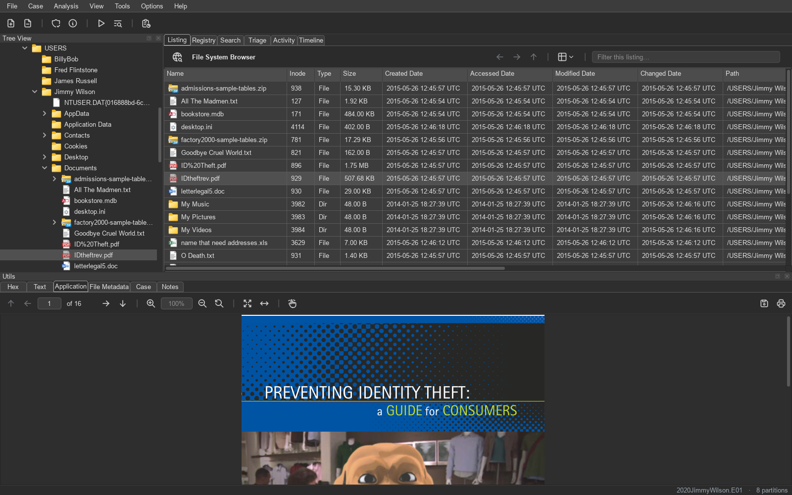
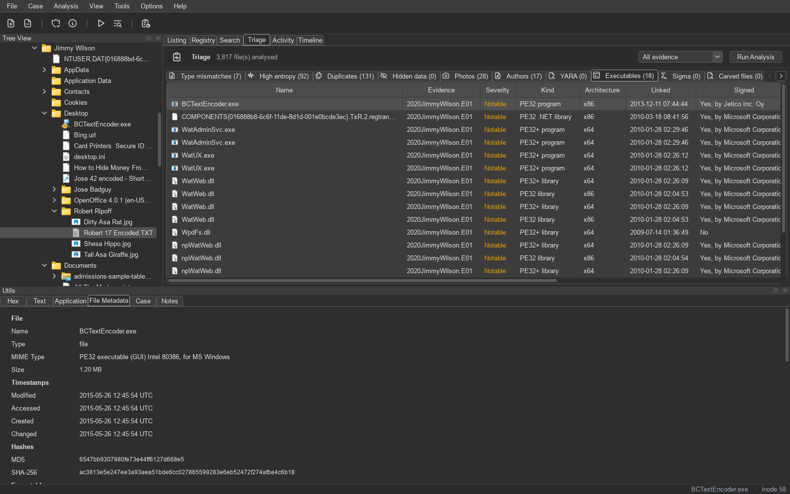
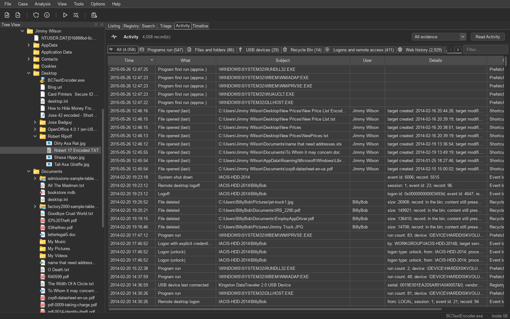
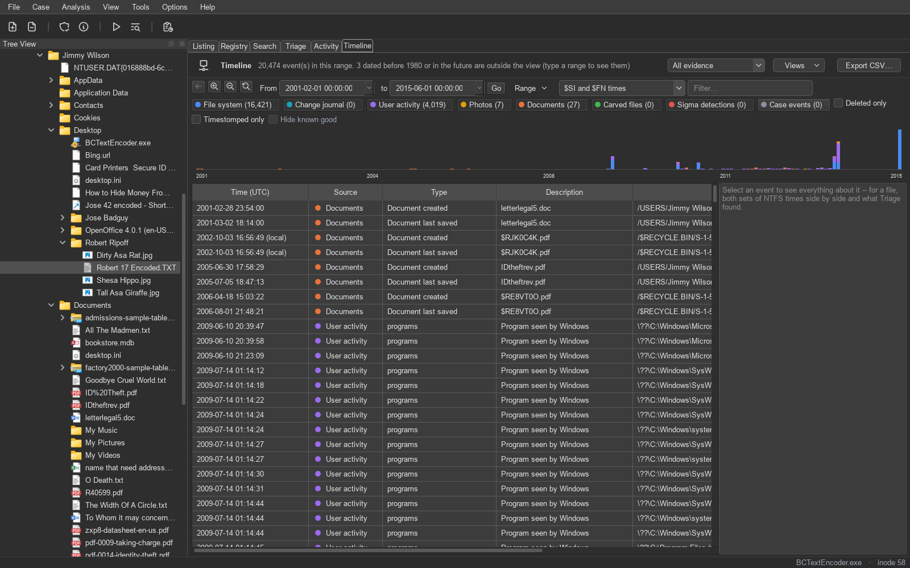
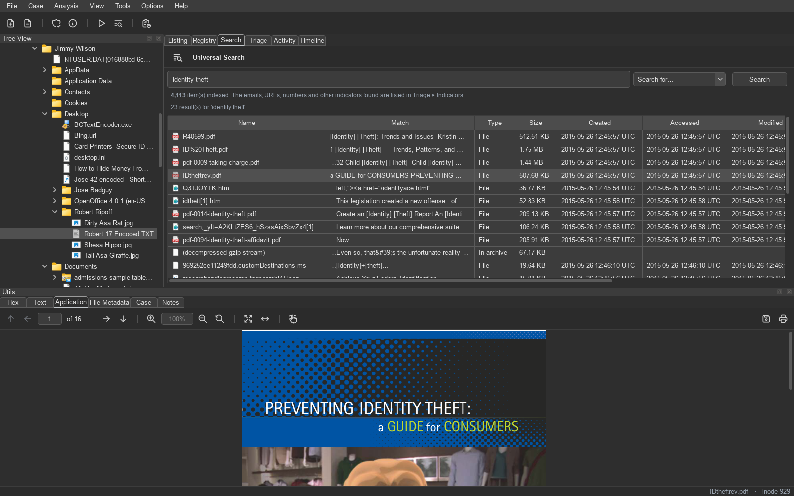
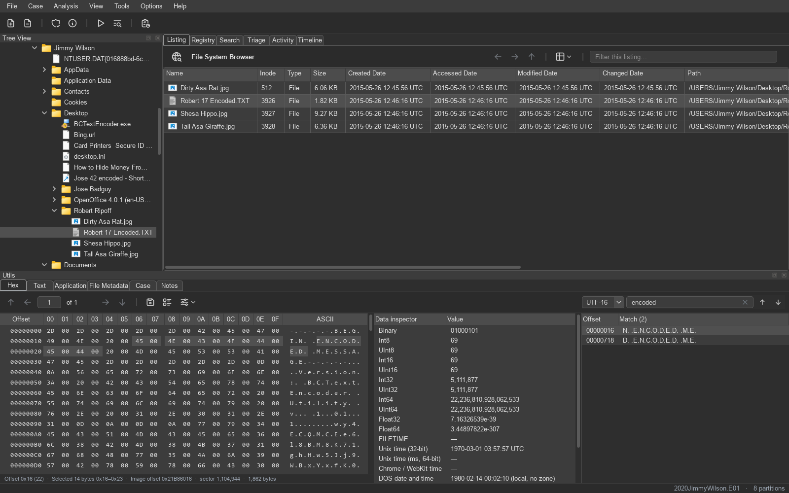
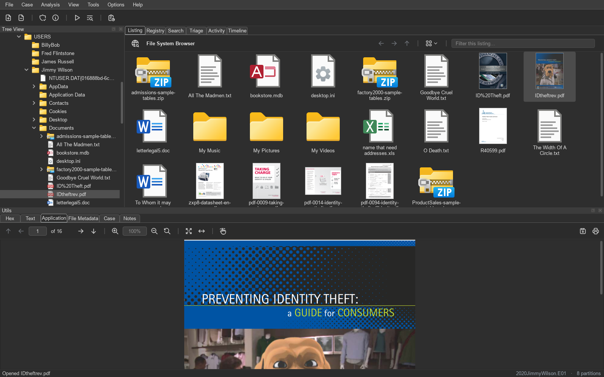
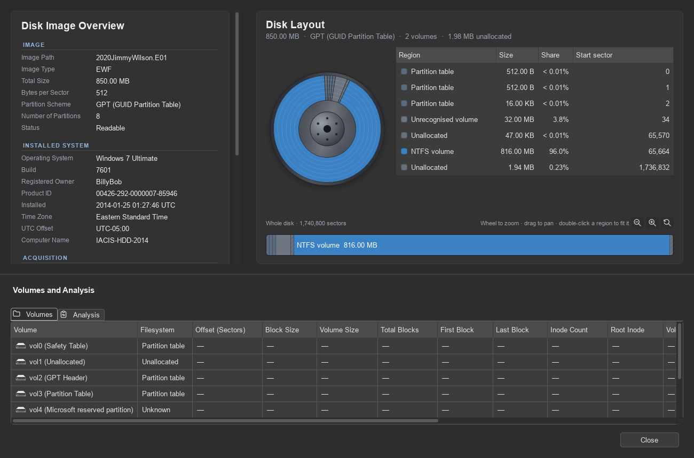
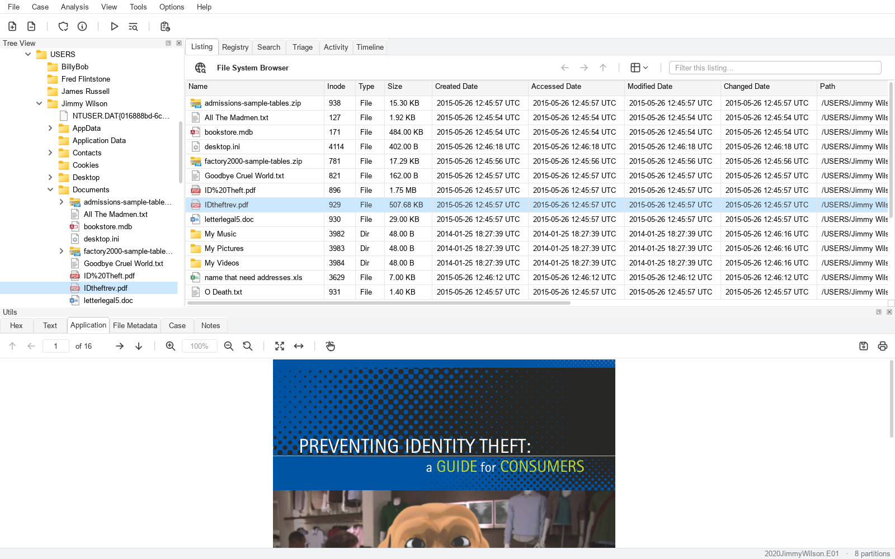
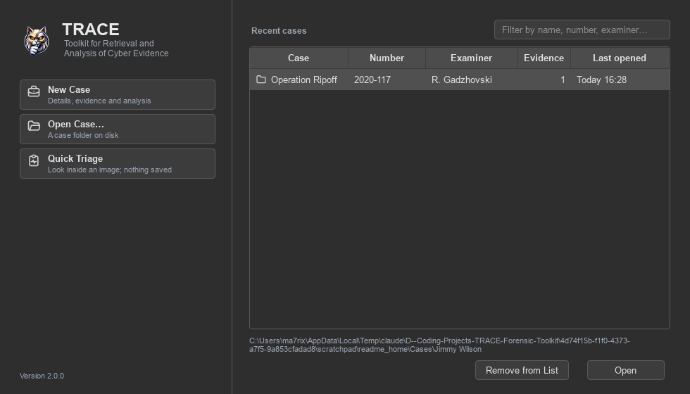

<div align="center">


# TRACE

**Toolkit for Retrieval and Analysis of Cyber Evidence**

Open disk images read-only, organise them into cases, triage what stands out,<br/>
search inside the evidence and recover deleted files — on Windows, macOS and Linux.

<p>
  
  
  
  
</p>

<a href="https://trace.gadzhovski.com/"><b>Website & docs</b></a> ·
<a href="https://github.com/Gadzhovski/TRACE-Forensic-Toolkit/releases/latest"><b>Download</b></a> ·
<a href="#features"><b>Features</b></a> ·
<a href="#screenshots"><b>Screenshots</b></a> ·
<a href="#supported-evidence"><b>Evidence</b></a> ·
<a href="#installation"><b>Install</b></a>

<br/><br/>



</div>

## Features

- **Cases** — one investigation, any number of images, with custody details,
  an audit trail, bookmarks, notes and a PDF/HTML report.
- **Integrity** — evidence is never mounted or written to. Every image is
  hashed in full (MD5, SHA-1, SHA-256; a read that fails gives no hash) and
  checked against the hashes it stores, its acquisition log and the case's
  record, which is never replaced; an E01's chunk checksums locate damaged
  sectors. Every check is kept, and the audit trail is append-only and
  hash-chained. Exports are hashed, read back and listed in a manifest.
- **Triage** — file types from content, entropy, hidden data, photo GPS,
  document authors, Office macros (VBA source, auto-run and download /
  execute calls flagged), executables with imphash and Rich-header
  hashes, duplicates and hash sets.
- **User activity** — programs run, files opened, USB devices, logons, the
  Recycle Bin, browser history, chats and phone backups, on one timeline.
- **Search** — full-text search inside documents, mail and archives, plus
  emails, URLs, phone numbers, card numbers and IBANs found automatically.
- **Detection** — YARA rules over files, Sigma rules over event logs,
  keyword lists and persistence (autoruns) graded by risk.
- **File carving** — 70 file types from unallocated space or slack, checked
  for completeness, with fragmented ZIP and PDF files rebuilt.
- **Viewers** — pictures, video, PDF, Office (password-protected ones
  opened with their password), mail including Outlook .msg, network
  captures (hosts, DNS, HTTP, TLS server names), SQLite (files stored in
  cells opened as files), registry hives, a hex editor with a data
  inspector, and HTML shown offline.
- **Under the hood** — NTFS $MFT, $UsnJrnl and $LogFile, shadow copies,
  BitLocker / FileVault / LUKS unlocking, Core Storage, APFS, LVM, XFS and
  Btrfs volumes; Parallels, VMware, Hyper-V, QEMU and Mac disk images;
  hardware and software RAID, Windows dynamic disks, lost partitions;
  CPIO, LZMA and zlib streams, damaged gzip recovered as far as it reads.

## Screenshots

| Triage | Activity |
|:--:|:--:|
|  |  |
| **Timeline** — every source in one view | **Search** — inside documents, mail and archives |
|  |  |
| **Hex view** — search, data inspector, selection | **Thumbnails** — pictures, videos and documents |
|  |  |
| **Registry** — every hive on the image | **Image information** — the disk's layout |
|  |  |

<details>
<summary><b>Light theme and welcome screen</b></summary>





</details>

<sub>Screenshots show the 2020 Jimmy Wilson training image.</sub>

## Supported evidence

| | |
|:--|:--|
| **Disk images** | E01 / Ex01, AFF4, raw / dd (split too), ISO, DMG, VMDK, VHD / VHDX, QCOW2 |
| **Logical images** | AD1, L01, ZIP / TAR, a folder (KAPE, Velociraptor), iOS backups |
| **Live disks** | an attached disk, read-only, without imaging it first |
| **File systems** | NTFS, FAT, exFAT, ext2/3/4, HFS+, APFS, XFS, Btrfs, UFS, ISO 9660 |
| **Encrypted volumes** | BitLocker, FileVault 2, LUKS, encrypted APFS and iOS backups |
| **Inside files** | archives (ZIP, 7z, RAR, TAR…), PST / OST, EML / mbox, registry hives, event logs, SQLite |

## Installation

Python **3.10 or newer**. Everything installs from pre-built packages — no
compiler, and on macOS no Homebrew.

**Windows**

```powershell
git clone https://github.com/Gadzhovski/TRACE-Forensic-Toolkit.git
cd TRACE-Forensic-Toolkit
powershell -ExecutionPolicy Bypass -File install_windows.ps1
venv\Scripts\activate
python main.py
```

**macOS, Linux and WSL**

```bash
git clone https://github.com/Gadzhovski/TRACE-Forensic-Toolkit.git
cd TRACE-Forensic-Toolkit
./install.sh
source venv/bin/activate
python main.py
```

A standalone app (Windows `.zip`, macOS `.dmg`) is built with
`python build_app.py`, and every push builds them on GitHub Actions.

## Testing

Every change to `master` is installed from scratch and tested on Windows,
macOS (Apple Silicon and Intel) and Linux, against public forensic test images
(DFTT, DFRWS, NPS, NIST). File carving is scored against the answer keys their
authors published. Run the suite locally, in parallel, with:

```bash
python tools/fetch_test_images.py
python -m pytest -n auto --dist loadfile
```

---

<div align="center">

Released under the [MIT License](LICENSE) ·
Developed by [**Radoslav Gadzhovski**](https://linkedin.com/in/radoslav-gadzhovski)

<sub>Built with PySide6, The Sleuth Kit (pytsk3), libewf and the libyal libraries, PyMuPDF, Pillow and Tabler Icons.</sub>

</div>
